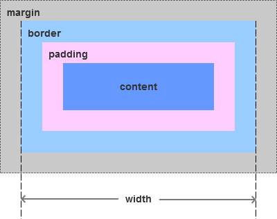
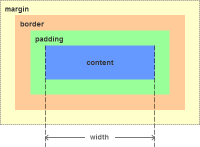

# CSS框模型

## 定义

**CSS 框模型 (Box Model) 规定了元素框处理元素内容、内边距、边框 和 外边距 的方式，也叫做CSS盒模型**

- **通俗理解**：*盒模型，顾名思义，就是一个盒子。生活中的盒子，有长宽高，盒子本身也有厚度，可以用来装东西。页面上的盒模型我们可以理解为，从盒子顶部俯视所得的一个平面图，盒子里装的东西，相当于盒模型的内容（content）；东西与盒子之间的空隙，理解为盒模型的内边距（padding）；盒子本身的厚度，就是盒模型的边框（border）；盒子外与其他盒子之间的间隔，就是盒子的外边距（margin）。*


## 盒模型标准（IE和w3c）

CSS盒模型分为IE盒模型和W3C盒模型。其实，IE盒模型是怪异模式（Quirks Mode）下的盒模型，而W3C盒模型是标准模式（Standards Mode）下的盒模型。

- IE盒模型




- W3C盒模型

  

从上图直观的可以看出，IE盒模型的宽度或者高度计算方式为：**width/height = content + padding + border**，W3C盒模型的宽度或者高度计算方式为：**width/height = content**。

 

## 怎么区分使用

浏览器选择哪个盒模型，主要看浏览器处于标准模式（Standards Mode）还是怪异模式（Quirks Mode）。我们都记得**<!DOCTYPE>**声明吧，这是告诉浏览器选择哪个版本的HTML，**<!DOCTYPE>**后面一般有DTD的声明，如果有DTD的声明，浏览器就是处于标准模式；如果没有DTD声明或者HTML4一下的DTD声明，那浏览器按照自己的方式解析代码，处于怪异模式。

​    处于标准模式的浏览器（IE浏览器版本必须是6或者6以上），会选择W3C盒模型解析代码；处于怪异模式的浏览器，则会按照自己的方式去解析代码，IE6以下则会是选择IE盒模型，其他现代的浏览器都是采用W3C盒模型。

​    因为IE6以下版本的浏览器没有遵循Web标准，不论页面开头有没有DTD声明，它都是按照IE盒模型解析代码的。

如果想自己设置，CSS3新增了一个属性**box-sizing: content-box | border-box | inherit**，默认值为**content-box**。如果值为**content-box**，那元素遵循的是W3C盒模型；如果值为**border-box**，那元素遵循的是IE盒模型；如果值为**inherit**，该属性的值应该从父元素继承。


## 理解标准模式的长宽


假设框的每个边上有 10 个像素的外边距和 5 个像素的内边距。如果希望这个元素框达到 100 个像素，就需要将内容的宽度设置为 70 像素。

```
#box {
  width: 70px;
  margin: 10px;
  padding: 5px;
}
```

**提示**：内边距、边框和外边距可以应用于一个元素的所有边，也可以应用于单独的边。

**提示**：外边距可以是负值，而且在很多情况下都要使用负值的外边距。